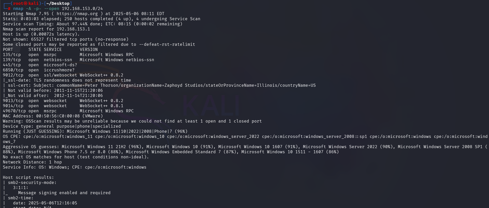
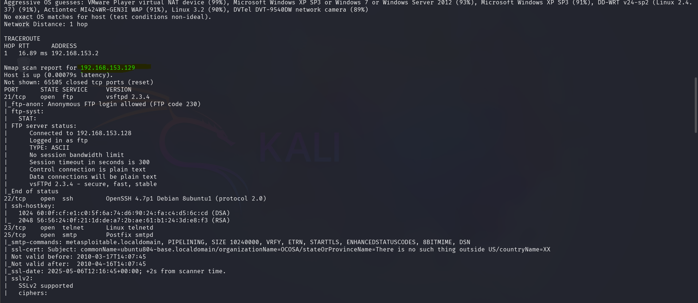
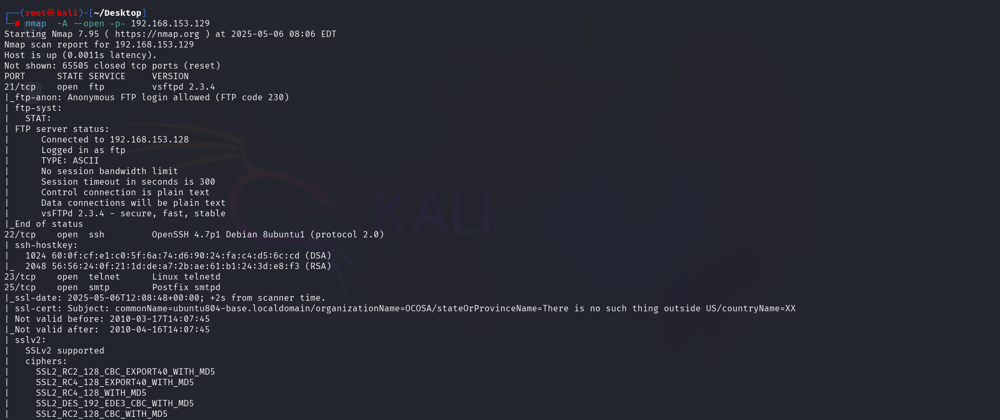
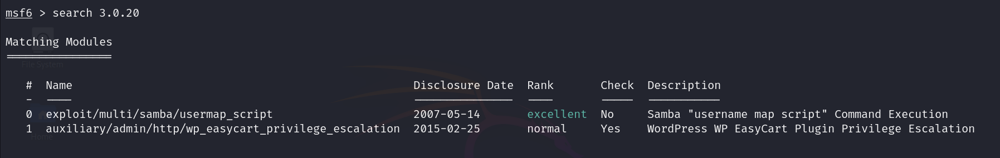
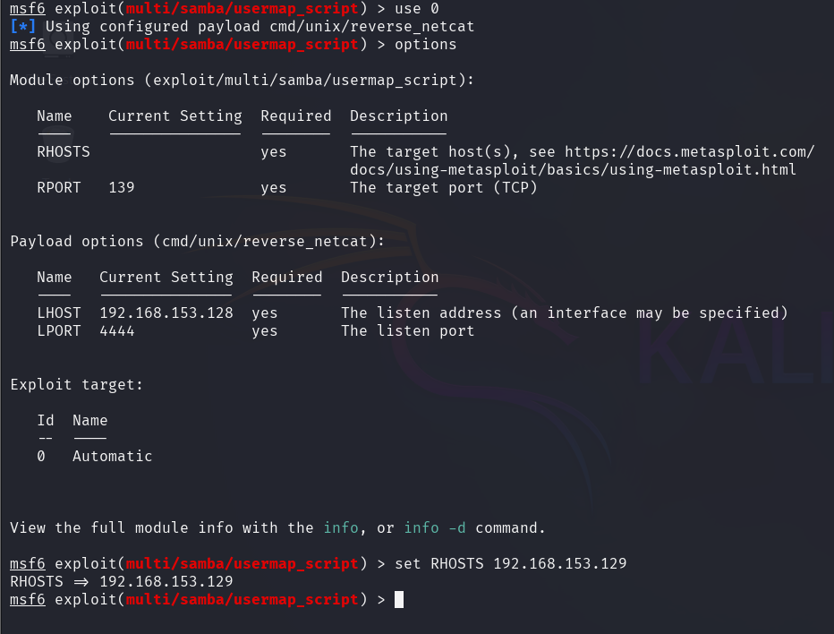
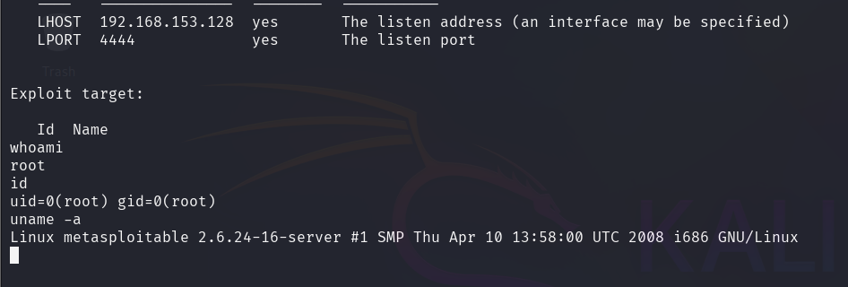

# CyberSecurity-task5

## 1. Host Scanning

  
In this step, I performed a network scan to identify active hosts. The image above shows the scanning process that reveals IP addresses currently online in the network.

## 2. Vulnerable Machine Detection

  
This screenshot highlights the identification of the Metasploit vulnerable machine's IP address from the scan results.

open ports 
<pre> <code> ``` 21/tcp open ftp vsftpd 2.3.4 22/tcp open ssh OpenSSH 4.7p1 Debian 8ubuntu1 (protocol 2.0) 23/tcp open telnet Linux telnetd 25/tcp open smtp Postfix smtpd 139/tcp open netbios-ssn Samba smbd 3.X - 4.X (workgroup: WORKGROUP) 445/tcp open netbios-ssn Samba smbd 3.0.20-Debian (workgroup: WORKGROUP) 512/tcp open exec netkit-rsh rexecd 513/tcp open login OpenBSD or Solaris rlogind 514/tcp open tcpwrapped 1099/tcp open java-rmi GNU Classpath grmiregistry 1524/tcp open bindshell Metasploitable root shell 2049/tcp open nfs 2-4 (RPC #100003) 2121/tcp open ftp ProFTPD 1.3.1 3306/tcp open mysql MySQL 5.0.51a-3ubuntu5 3632/tcp open distccd distccd v1 ((GNU) 4.2.4 (Ubuntu 4.2.4-1ubuntu4)) 5432/tcp open postgresql PostgreSQL DB 8.3.0 - 8.3.7 5900/tcp open vnc VNC (protocol 3.3) 6000/tcp open X11 (access denied) 6667/tcp open irc UnrealIRCd 6697/tcp open irc UnrealIRCd 8009/tcp open ajp13 Apache Jserv (Protocol v1.3) 8180/tcp open http Apache Tomcat/Coyote JSP engine 1.1 8787/tcp open drb Ruby DRb RMI (Ruby 1.8; path /usr/lib/ruby/1.8/drb) 42862/tcp open status 1 (RPC #100024) 47834/tcp open nlockmgr 1-4 (RPC #100021) 51530/tcp open mountd 1-3 (RPC #100005) 54693/tcp open java-rmi GNU Classpath grmiregistry ``` </code> </pre>


## 3. Nmap Full Port Scan

  
I used Nmap with aggressive scan flags and full port range to gather detailed information about the target system:
```
nmap -A --open -p- <target-ip>
```
The output provided open ports, service versions, and potential vulnerabilities.

## 4. Service Enumeration & Exploitation Targeting

  
From the Nmap results, I chose port **445**, which was running an SMB service with a specific version known for vulnerabilities. The image above shows the detailed output.

## 5. Exploit Selection in Metasploit

  
Using `msfconsole`, I searched for a suitable exploit related to the SMB service and selected one matching the discovered version.

## 6. Exploit Configuration

  
I configured the exploit by setting the required options, such as the target IP, payload type, and other necessary parameters.

## 7. Launching the Exploit

  
After setting up the exploit, I executed it using `run` in Metasploit. The image above shows the exploit being launched.

## 8. Successful System Access

  
This screenshot confirms that I successfully gained access to the target system, verifying that the exploitation was successful.
